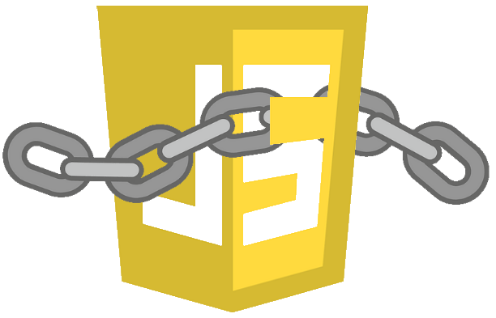

<p align="center">
  <a href="">
    
  </a>

  <h3 align="center">Constrain JS</h3>
  <div align="center">
    
    
    
  </div>

  <p align="center">
    A pure javascript method of limiting and controlling the properties of native js objects and JSON objects, along with extra builtin methods to make js easier to use.
    <br>
    <a href="https://github.com/lordfarquhar/constrainjs/issues/new?template=bug.md">Report bug</a>
    ·
    <a href="https://github.com/lordfarquhar/constrainjs/issues/new?template=feature.md&labels=feature">Request feature</a>
  </p>
</p>

> **WARNING** Major updates are being made to this package without a version change as this package is not made for public release yet


> **See our [docs](docs/index.md)** for full documentation

## Table of Contents

- [Table of Contents](#table-of-contents)
- [Quick Start Guide](#quick-start-guide)
- [What's included](#whats-included)
- [Compatibility](#compatibility)
- [Bugs and feature requests](#bugs-and-feature-requests)
- [Contributing](#contributing)
- [Authors](#authors)
- [Copyright and license](#copyright-and-license)

## Quick Start Guide

Require the package

```js
const constrainjs = require("constrainjs");
// or
const {ConstrainArray, ConstrainString} = require("constrainjs").native;
```

and start using the new native objects!

```js
const myArray = ["hello", "world"];
const options = {
    maxLength: 5,
    allowedTypes: ["string"]
}
const myBetterArray = new ConstrainArray(myArray, options)
```

> **See our [docs](docs/index.md)** for further documentation

## What's included

 - Native
   - Array (A custom and constrainable version of the native Array object)
   - String (A custom and constrainable version of the native String object)
 - JSON
   - Config (A JSON object access class, used by Schema for defining controlled schemas)
   - ConfigSchema (A Class used to define schemas and check objects against them)


## Compatibility

See [compatibility table](docs/compatibility.md)

## Bugs and feature requests

Have a bug or a feature request? Please first read the [issue guidelines](https://github.com/lordfarquhar/constrainjs/blob/master/CONTRIBUTING.md) and search for existing and closed issues. If your problem or idea is not addressed yet, [please open a new issue](https://github.com/lordfarquhar/constrainjs/issues/new).

## Contributing

Please read through our [contributing guidelines](https://github.com/lordfarquhar/constrainjs/blob/master/CONTRIBUTING.md). Included are directions for opening issues, coding standards, and notes on development.

VSCode Editor preferences are left available in the [editor config](https://github.com/lordfarquhar/constrainjs/blob/master/.vsconfig) to aid development, any changes made to this folder for personal preferences should *NOT* be committed to any PRs

## Authors

**Inanis**

Main developer and package initiator

- <https://github.com/lordfarquhar>

If you would like to join this list, please feel free to send a pull request!

<!-- ## Thanks -->


## Copyright and license

Code released under the [MIT License](https://github.com/lordfarquhar/constrainjs/blob/master/LICENSE).

Enjoy